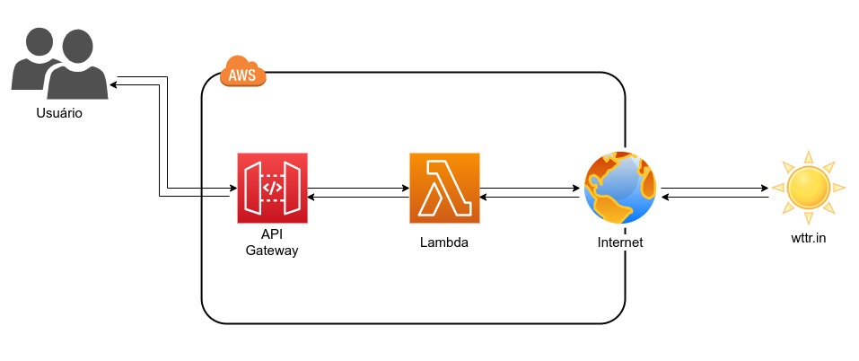

# Desafio Dock Banking as a service

Aqui está a arquitetura que deve ser desenvolvida no desafio para a primeira fase de testes de candidatos da Dock para às vagas de **Site Reliability Engineer / DevOps cloud**, o teste pode ser elaborado numa conta pessoal free tier da AWS mas o teste deve possuir um manual de como deve ser criado.



##Descrição do desafio
O candidato deve elaborar uma pequena aplicação lambda que faz uma request HTTP para o site **wittr.in** e retornar informações sobre o tempo.
Os pré requisitos são:
- Utilizar uma das seguintes linguagens: Python, NodeJS ou Java;
- Elaborar a IAC dos componentes da arquitetura proposta (API gateway e a função lambda), você pode utilizar Terraform ou Cloudformation;
- Elaborar um README.md com um passo a passo de como provisionar os componentes e a aplicação na AWS;

Não há diferença de testes para diferentes níveis de profissionais, porém ambos os testes serão avaliados com diferentes critérios, dependendo do perfil da vaga.

##Estrutura organizacional do teste
```bash
├── application -----------------------------------------> Onde o seu código deve estar armazenado;
│
├── cloudformation --------------------------------------> Onde o seu código Cloudformation deve estar armazenado caso escolha utilizar essa ferramenta;
│   ├── parameters
│   └── template
│
├── README.md -------------------------------------------> Sua documentação com o passo a passo de como subir os componentes e a aplicação na AWS;
│
└── terraform -------------------------------------------> Onde o seu código Terraform deve estar armazenado caso escolha utilizar essa ferramenta;
    ├── main.tf
    └── vars.tf
```

## Como entregar este desafio
Você deve realizar o _**fork**_ este projeto e fazer o **_push_** no seu próprio repositório e enviar o link como resposta ao recrutador que lhe enviou o teste, junto com seu LinkedIn atualizado.

A implementação deve ficar na pasta correspondente ao desafio. Fique à vontade para adicionar qualquer tipo de conteúdo que julgue útil ao projeto, alterar/acrescentar um README com instruções de como executá-lo, etc.

**Obs.**:
- Você não deve fazer um Pull Request para este projeto!

## Extras

- Descreva como utilizar a sua solução;
- Sempre considerar melhores práticas como se fosse um ambiente de produção;


Boas implementações! 

